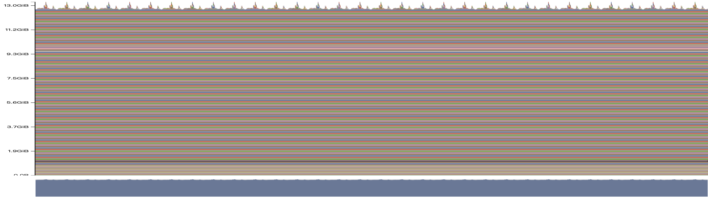
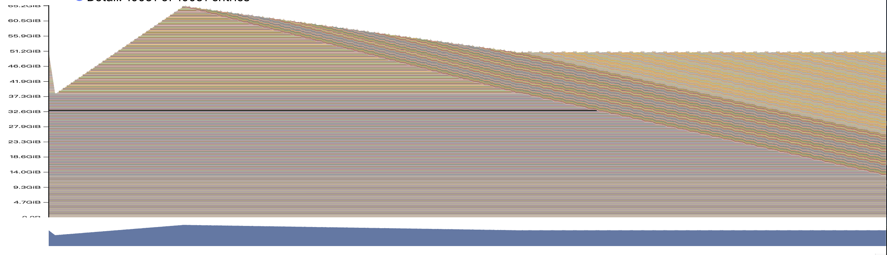
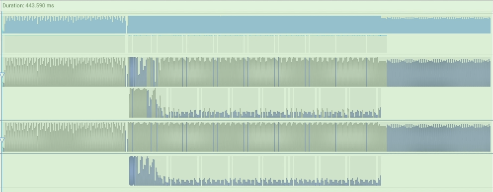
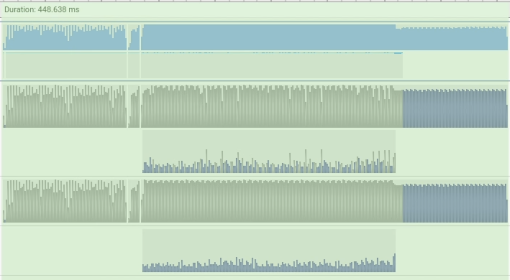
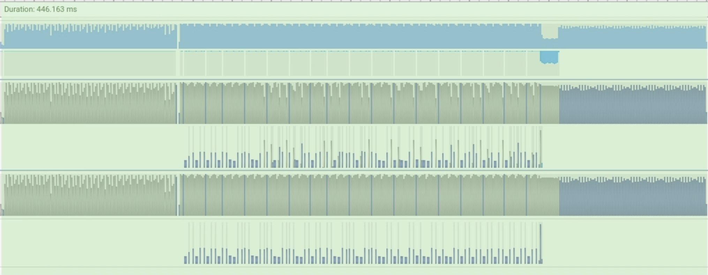
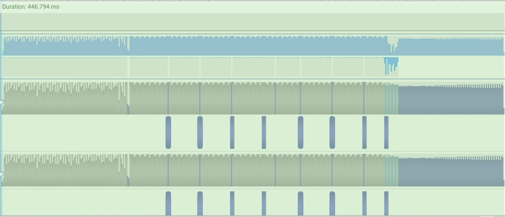

## Problem `benchmarking_script`: Benchmarking Script (4 points)

### (b)
**Question:** Time the forward and backward passes for the model sizes described in §1.1.2. Use 5 warmup steps and compute the average and standard deviation of timings over 10 measurement steps. How long does a forward pass take? How about a backward pass? Do you see high variability across measurements, or is the standard deviation small?

**Deliverable:** A 1-2 sentence response with your timings.

**Answer:** The table below reports the measured forward and backward timings for the five model sizes from Section 1.1.2 using 5 warmup steps and 10 measured steps at context length 128, batch size 4, vocabulary size 10,000, and FP32 precision. Forward and backward latency both increase with model size, while the standard deviations remain small relative to the means, indicating that the measurements are stable after warmup.

| Model size | Forward mean (ms) | Forward std (ms) | Backward mean (ms) | Backward std (ms) | Total mean (ms) | Total std (ms) |
| --- | ---: | ---: | ---: | ---: | ---: | ---: |
| small | 21.837 | 0.057 | 21.164 | 0.039 | 43.001 | 0.076 |
| medium | 42.146 | 0.455 | 50.833 | 0.047 | 92.979 | 0.472 |
| large | 62.412 | 1.055 | 117.320 | 0.288 | 179.732 | 1.074 |
| xl | 101.257 | 0.124 | 213.640 | 0.122 | 314.898 | 0.168 |
| 2.7b | 158.532 | 0.209 | 316.248 | 0.187 | 474.780 | 0.315 |

### (c)
**Question:** One caveat of benchmarking is not performing the warm-up steps. Repeat your analysis without the warm-up steps. How does this affect your results? Why do you think this happens? Also try to run the script with 1 or 2 warm-up steps. Why might the result still be different?

**Deliverable:** A 2-3 sentence response.

**Answer:** Removing warmup makes the measurements much noisier and substantially inflates both the means and the standard deviations, because the first measured iteration absorbs one-time startup costs such as CUDA runtime initialization, kernel loading, memory allocation, and library autotuning. For example, with `warmup=0`, the first measured `small` step took about 602 ms and the first measured `xl` step took about 905 ms, even though subsequent steps were near 42 ms and 315 ms respectively. Using 2 warmup steps already brings the results much closer to the 5-warmup baseline, but small differences can remain because not all lazy initialization and caching effects are exhausted immediately, and ordinary run-to-run system noise is still present.

---

## Problem `nsys_profile`: Nsight Systems Profiler (5 points)

### (a)
**Question:** What is the total time spent on your forward pass? Does it match what we had measured before with the Python standard library?

**Deliverable:** A 1-2 sentence response.

**Answer:** At context length 128, Nsight Systems reports forward-pass times of 25.245 ms (`small`), 49.488 ms (`medium`), 75.931 ms (`large`), 101.033 ms (`xl`), and 158.597 ms (`2.7b`). Compared with the earlier Python benchmark from `1.1.3(b)` (21.837 ms, 42.146 ms, 62.412 ms, 101.257 ms, and 158.532 ms respectively), the agreement is very close for `xl` and `2.7b`, but noticeably looser for the smaller three models, so the overall trend matches while the exact values do not align equally well across all sizes.

### (b)
**Question:** What CUDA kernel takes the most cumulative GPU time during the forward pass? How many times is this kernel invoked during a single forward pass of your model? Is it the same kernel that takes the most runtime when you do both forward and backward passes?

**Deliverable:** A 1-2 sentence response.

**Answer:** In a representative `2.7b`, context-length-512 forward trace, the CUDA GPU Kernel Summary is dominated by the Tensor Core GEMM kernel `sm80_xmma_gemm_f32f32_f32f32_f32_tn_n_tilesize64x64x8_...`, which appears 975 times across the 15 profiled forward passes, i.e. about 65 times per forward pass. In the corresponding full training-step trace, the top kernel is still a Tensor Core GEMM, but it changes to `sm80_xmma_gemm_f32f32_f32f32_f32_tn_n_tilesize128x64x8_...` rather than remaining exactly the same kernel.

### (c)
**Question:** Although the vast majority of FLOPs take place in matrix multiplications, you will notice that several other kernels still take a non-trivial amount of the overall runtime. What other kernels besides matrix multiplies do you see accounting for non-trivial CUDA runtime in the forward pass?

**Deliverable:** A 1-2 sentence response.

**Answer:** Besides GEMM kernels, the CUDA GPU Kernel Summary still shows visible time in ATen `elementwise_kernel`, `vectorized_elementwise_kernel`, and `reduce_kernel` launches. In the representative `2.7b`, context-length-512 forward trace, these non-matmul kernels are much smaller than the dominant GEMMs, but several still contribute on the order of about 0.5%-1.5% each to total GPU time.

### (d)
**Question:** Profile running one complete training step with your implementation of AdamW (i.e., the forward pass, computing the loss and running a backward pass, and finally an optimizer step, as you'd do during training). How does the fraction of time spent on matrix multiplication change, compared to doing inference (forward pass only)? How about other kernels?

**Deliverable:** A 1-2 sentence response.

**Answer:** In the representative `2.7b`, context-length-512 traces, kernels whose names contain `gemm`, `xmma`, or `cutlass` account for about `92.20%` of forward-only GPU time but about `83.90%` of full training-step GPU time, so matrix multiplication still dominates training but by a smaller margin than in inference. The missing share is taken up by backward- and optimizer-related ATen `elementwise_kernel`, `vectorized_elementwise_kernel`, and `reduce_kernel` launches, which become much more prominent once gradient computation and AdamW updates are included.

### (e)
**Question:** Compare the runtime of the softmax operation versus the matrix multiplication operations within the self-attention layer of your model during a forward pass. How does the difference in runtimes compare to the difference in FLOPs?

**Deliverable:** A 1-2 sentence response.

**Answer:** Interpreting the "self-attention layer" here as the core scaled-dot-product attention, the representative `2.7b`, context-length-512 forward trace reports `attention_softmax` at about `626,461 ns` on average, versus about `380,087 ns` for `attention_scores_matmul` and `329,561 ns` for `attention_value_matmul`, so softmax is slower than either individual matmul and is still on the same order as the two matmuls together. However, the FLOP gap is much larger: the scripted estimate gives each matmul about `5.37e9` FLOPs per layer versus only about `2.35e8` for softmax (about `22.87x` larger for each matmul, or `45.74x` for the two matmuls combined), which suggests that softmax is much more memory- and reduction-bound than the GEMM kernels.

---

## Problem `mixed_precision_accumulation`: Mixed Precision (1 point)

### Accumulation experiment
**Question:** Run the following code and comment on the accuracy of the results.

```python
s = torch.tensor(0, dtype=torch.float32)
for i in range(1000):
    s += torch.tensor(0.01, dtype=torch.float32)
print(s)

s = torch.tensor(0, dtype=torch.float16)
for i in range(1000):
    s += torch.tensor(0.01, dtype=torch.float16)
print(s)

s = torch.tensor(0, dtype=torch.float32)
for i in range(1000):
    s += torch.tensor(0.01, dtype=torch.float16)
print(s)

s = torch.tensor(0, dtype=torch.float32)
for i in range(1000):
    x = torch.tensor(0.01, dtype=torch.float16)
    s += x.type(torch.float32)
print(s)
```

**Deliverable:** A 2-3 sentence response.

**Answer:** Accumulating `0.01` in FP32 stays very close to the expected value of `10`, while accumulating in FP16 underestimates much more noticeably (`9.9531` in our run), because both the input value and the running sum are repeatedly rounded at FP16 precision. Using FP16 inputs with an FP32 accumulator is much more accurate (`10.0021` here), even though it is still slightly worse than pure FP32 because the value `0.01` has already been quantized once when it is first represented in FP16. This illustrates why mixed-precision training usually keeps reductions and accumulations in higher precision even when some inputs or matmuls use lower precision.

### 1.1.5(a) Dtypes Under Autocast
**Question:** Consider the following model. Suppose we are training the model on a GPU and that the model parameters are originally in FP32. We'd like to use autocasting mixed precision with FP16. What are the data types of:

```python
class ToyModel(nn.Module):
    def __init__(self, in_features: int, out_features: int):
        super().__init__()
        self.fc1 = nn.Linear(in_features, 10, bias=False)
        self.ln = nn.LayerNorm(10)
        self.fc2 = nn.Linear(10, out_features, bias=False)
        self.relu = nn.ReLU()

    def forward(self, x):
        x = self.relu(self.fc1(x))
        x = self.ln(x)
        x = self.fc2(x)
        return x
```

- the model parameters within the autocast context,
- the output of the first feed-forward layer,
- the output of layer norm,
- the model's predicted logits,
- the loss,
- and the model's gradients?

**Deliverable:** The data types for each of the components listed above.

**Answer:** In our CUDA autocast check, the model parameters remain `float32`, the output of the first feed-forward layer (`fc1`) is `float16`, the output of layer norm is `float32`, the model logits are `float16`, the loss is `float32`, and the gradients are `float32`. This matches the intended mixed-precision pattern: linear layers run in lower precision where possible, while numerically sensitive normalization, loss computation, and stored parameter/gradient state stay in FP32.

### 1.1.5(b) LayerNorm and Mixed Precision
**Question:** You should have seen that FP16 mixed precision autocasting treats the layer normalization layer differently than the feed-forward layers. What parts of layer normalization are sensitive to mixed precision? If we use BF16 instead of FP16, do we still need to treat layer normalization differently? Why or why not?

**Deliverable:** A 2-3 sentence response.

**Answer:** The numerically sensitive parts of layer normalization are the mean/variance reductions, the accumulation of squared values, and the normalization step itself (subtracting the mean and dividing by the standard deviation), because these operations can amplify rounding error and are more vulnerable to overflow or underflow in low precision. With FP16, this makes it important to keep LayerNorm in higher precision. BF16 is much more stable because it has the same exponent range as FP32, so the overflow/underflow problem is much less severe, but its mantissa is still shorter than FP32, so treating LayerNorm more carefully can still improve numerical robustness.

### 1.1.5(c) BF16 Benchmarking
**Question:** Modify your benchmarking script to optionally run the model using mixed precision with BF16. Time the forward and backward passes with and without mixed-precision for each language model size described in §1.1.2. Compare the results of using full vs. mixed precision, and comment on any trends as model size changes. You may find the `nullcontext` no-op context manager to be useful.

**Deliverable:** A 2-3 sentence response with timings and commentary.

**Answer:** BF16 mixed precision provides little or no benefit on the smallest workloads, but it becomes increasingly effective as model size and context length grow. For example, at context length `128`, the total step time changes from `42.48 ms` to `46.74 ms` for `small` (`0.91x`) but from `475.01 ms` to `202.29 ms` for `2.7b` (`2.35x`), while at context length `1024` the same comparison is `195.26 ms` to `98.84 ms` for `small` (`1.98x`) and `3766.59 ms` to `1181.84 ms` for `2.7b` (`3.19x`). This pattern is consistent with larger workloads benefiting much more from Tensor Core acceleration once matrix multiplications dominate the runtime. The full timing tables are archived in `artifacts/experiments/ch1/1_1_5c/summary.md`.

---

## Problem `memory_profiling`: Memory Profiling (4 points)

### (a)
**Question:** Add an option to your profiling script to run your model through the memory profiler. It may be helpful to reuse some of your previous infrastructure (e.g., to activate mixed-precision, load specific model sizes, etc). Then, run your script to get a memory profile of the 2.7B model when either doing inference only (just forward pass) or a full training step. How do your memory timelines look like? Can you tell which stage is running based on the peaks you see?

**Deliverable:** Two images of the "Active memory timeline" of a 2.7B model, from the memory_viz tool: one for the forward pass, and one for running a full training step (forward and backward passes, then optimizer step), and a 2-3 sentence response.

**Answer:**

Forward-pass timeline:



Training-step timeline:



Response:

The forward-only active-memory timeline is not completely flat: it shows a roughly periodic sequence of about `32` spikes, which lines up well with the `32` Transformer blocks in the `2.7b` model. The spike size is on the order of about `128 MiB`, which is consistent with transient attention score/probability tensors of shape `batch x heads x seq x seq` being materialized and then released within each block during inference. The full training-step timeline has a clearer multi-stage structure: memory first drops sharply, then rises relatively quickly, then decreases more gradually, and finally rises again. This is consistent with the forward pass building up saved activations, the backward pass releasing part of that activation memory while traversing the graph, and the final optimizer step plus allocator/cache effects changing the live-memory footprint again. So yes, the timeline shape is informative enough that the broad stages of the training step can be inferred from the peaks and valleys.

### (b)
**Question:** What is the peak memory usage of each context length when doing a forward pass? What about when doing a full training step?

**Deliverable:** A table with two numbers per context length.

**Answer:**

| Context length | Forward peak memory | Full training step peak memory |
| --- | --- | --- |
| 128 | 12.93 GiB | 51.44 GiB |
| 256 | 13.02 GiB | 51.44 GiB |
| 512 | 13.45 GiB | 65.52 GiB |

Forward-only peak memory grows with context length but only moderately, whereas the full training step uses much more memory overall and shows a much larger increase by context length 512. This is consistent with training needing to retain saved activations, gradients, and optimizer-related state in addition to the forward-pass allocations.

### (c)
**Question:** Find the peak memory usage of the 2.7B model when using mixed-precision, for both a forward pass and a full optimizer step. Does mixed-precision significantly affect memory usage?

**Deliverable:** A 2-3 sentence response.

**Answer:** In this setup, BF16 does not significantly reduce measured peak memory overall. For forward-only runs, the measured peak memory is actually higher under BF16 at all three tested context lengths (`12.93 -> 19.16 GiB`, `13.02 -> 19.18 GiB`, and `13.45 -> 19.41 GiB` for context lengths `128`, `256`, and `512` respectively), while for full training steps it is nearly unchanged at shorter contexts (`51.44 -> 51.44 GiB` at `128`, `51.44 -> 52.11 GiB` at `256`) and only modestly lower at `512` (`65.52 -> 62.69 GiB`). A plausible explanation is that BF16 autocast changes the execution path rather than simply shrinking every tensor: parameters and optimizer state still remain in FP32, while extra cast/workspace buffers can be introduced during lower-precision execution, so the net peak-memory effect is small and can even be negative for forward-only runs.

### (d)
**Question:** Consider the 2.7B model. At our reference hyperparameters, what is the size of a tensor of activations in the Transformer residual stream, in single-precision? Give this size in MB (i.e., divide the number of bytes by 1024^2).

**Deliverable:** A 1-2 sentence response with your derivation.

**Answer:** For the 2.7B model, the residual-stream activation tensor at the reference hyperparameters has shape

$$
(\mathrm{batch\ size}, \mathrm{context\ length}, d_{\mathrm{model}}) = (4, 128, 2560),
$$

so it contains

$$
4 \cdot 128 \cdot 2560 = 1{,}310{,}720
$$

elements. In single precision this is

$$
1{,}310{,}720 \cdot 4 = 5{,}242{,}880 \text{ bytes} = 5.00 \text{ MiB},
$$

after dividing by $1024^2$.

### (e)
**Question:** Now look closely at the "Active Memory Timeline" from pytorch.org/memory_viz of a memory snapshot of the 2.7B model doing a forward pass. When you reduce the "Detail" level, the tool hides the smallest allocations to the corresponding level (e.g., putting "Detail" at 10% only shows the 10% largest allocations). What is the size of the largest allocations shown? Looking through the stack trace, can you tell where those allocations come from?

**Deliverable:** A 1-2 sentence response.

**Answer:** The largest allocations visible in the forward-pass memory snapshot are about `128 MiB` each. Their stack traces point to the `softmax` call inside `scaled_dot_product_attention`, which matches the size of an explicitly materialized attention score/weight tensor of shape $(\mathrm{batch}, \mathrm{heads}, \mathrm{seq\ len}, \mathrm{seq\ len})$ for the `2.7b` model at `batch=4`, `heads=32`, and `seq_len=512`:

$$
4 \cdot 32 \cdot 512 \cdot 512 \cdot 4 \text{ bytes} = 128 \text{ MiB}.
$$

So these allocations come from the naive self-attention implementation rather than the residual-stream activations.

---

## Problem `pytorch_attention`: Benchmarking PyTorch Attention (2 points)

### (a)
**Question:** Benchmark your attention implementation at different scales. Write a script that will:

- Fix the batch size to 8 and don't use multihead attention (i.e. remove the head dimension).
- Iterate through the cartesian product of `[16, 32, 64, 128]` for the head embedding dimension `d_model`, and `[256, 1024, 4096, 8192, 16384]` for the sequence length.
- Create random inputs `Q`, `K`, `V` for the appropriate size.
- Time 100 forward passes through attention using the inputs.
- Measure how much memory is in use before the backward pass starts, and time 100 backward passes.
- Make sure to warm up, and to call `torch.cuda.synchronize()` after each forward/backward pass.

Report the timings (or out-of-memory errors) you get for these configurations. At what size do you get out-of-memory errors? Do the accounting for the memory usage of attention in one of the smallest configurations you find that runs out of memory (you can use the equations for memory usage of Transformers from Assignment 1). How does the memory saved for backward change with the sequence length? What would you do to eliminate this memory cost?

**Deliverable:** A table with your timings, your working out for the memory usage, and a 1-2 paragraph response.

**Answer:**

| d_model | Sequence length | Forward timing (ms) | Backward timing (ms) | Saved for backward (GiB) | Status |
| --- | --- | ---: | ---: | ---: | --- |
| 16 | 256 | 0.262 | 0.605 | 0.004 | success |
| 16 | 1024 | 0.323 | 0.849 | 0.063 | success |
| 16 | 4096 | 3.298 | 7.581 | 1.002 | success |
| 16 | 8192 | 13.383 | 31.941 | 4.005 | success |
| 16 | 16384 | 51.331 | 121.836 | 16.009 | success |
| 32 | 256 | 0.244 | 0.562 | 0.004 | success |
| 32 | 1024 | 0.339 | 0.866 | 0.064 | success |
| 32 | 4096 | 3.469 | 7.728 | 1.004 | success |
| 32 | 8192 | 14.281 | 29.686 | 4.009 | success |
| 32 | 16384 | 55.450 | 115.465 | 16.017 | success |
| 64 | 256 | 0.246 | 0.552 | 0.004 | success |
| 64 | 1024 | 0.366 | 0.918 | 0.065 | success |
| 64 | 4096 | 4.009 | 8.757 | 1.008 | success |
| 64 | 8192 | 16.264 | 33.791 | 4.016 | success |
| 64 | 16384 | 61.564 | 128.291 | 16.033 | success |
| 128 | 256 | 0.269 | 0.659 | 0.005 | success |
| 128 | 1024 | 0.449 | 1.117 | 0.066 | success |
| 128 | 4096 | 5.298 | 11.448 | 1.016 | success |
| 128 | 8192 | 20.726 | 42.572 | 4.032 | success |
| 128 | 16384 | 79.873 | 166.429 | 16.064 | success |

Memory accounting:

For a single FP32 attention intermediate of shape $(B, T, T)$, the memory cost is

$$
B \cdot T \cdot T \cdot 4 \text{ bytes}.
$$

However, the measured memory saved for backward is closer to about twice that amount, because by the end of the forward pass the naive implementation appears to keep roughly two large $B \times T \times T$ FP32 intermediates alive, corresponding naturally to the pre-softmax attention scores and the post-softmax attention weights. For example, with $B = 8$ and $T = 16384$, one such tensor would require

$$
8 \cdot 16384 \cdot 16384 \cdot 4 = 8 \text{ GiB},
$$

while the measured saved-for-backward memory is about `16 GiB`, consistent with storing about two such tensors rather than just one.

Response:

In the tested range, none of the requested configurations ran out of memory, so we did not observe an OOM threshold within this sweep. Even without an actual OOM, however, the quadratic memory trend is very clear: the memory saved for backward depends overwhelmingly on sequence length rather than embedding dimension, and it grows by about `4x` whenever the sequence length doubles. For example, at `d_model=128`, the saved-for-backward memory increases from about `1.02 GiB` at `T=4096` to `4.03 GiB` at `T=8192` and then to `16.06 GiB` at `T=16384`.

The timing results show the same high-level pattern. Both forward and backward latency rise sharply with sequence length, while increasing `d_model` has a much smaller effect than increasing `T`. This indicates that the dominant bottleneck in naive attention at long sequence length is the `T x T` attention matrix and its associated memory traffic, not the `T x d_model` inputs themselves. To eliminate this memory cost, we would avoid explicitly materializing the full attention matrix and instead use a tiled attention algorithm with online softmax and recomputation, as in FlashAttention.

---

## Problem `torch_compile`: Benchmarking JIT-Compiled Attention (2 points)

### (a)
**Question:** Extend your attention benchmarking script to include a compiled version of your PyTorch implementation of attention, and compare its performance to the uncompiled version with the same configuration as the `pytorch_attention` problem above.

**Deliverable:** A table comparing your forward and backward pass timings for your compiled attention module with the uncompiled version from the `pytorch_attention` problem above.

**Answer:**

| d_model | Sequence length | Uncompiled forward (ms) | Compiled forward (ms) | Forward speedup | Uncompiled backward (ms) | Compiled backward (ms) | Backward speedup |
| --- | --- | ---: | ---: | ---: | ---: | ---: | ---: |
| 16 | 256 | 0.257 | 0.212 | 1.21x | 0.605 | 0.507 | 1.19x |
| 16 | 1024 | 0.315 | 0.226 | 1.39x | 0.826 | 0.592 | 1.40x |
| 16 | 4096 | 3.291 | 1.568 | 2.10x | 7.520 | 3.486 | 2.16x |
| 16 | 8192 | 13.348 | 5.455 | 2.45x | 31.717 | 15.373 | 2.06x |
| 16 | 16384 | 51.325 | 21.015 | 2.44x | 121.785 | 57.350 | 2.12x |
| 32 | 256 | 0.266 | 0.216 | 1.23x | 0.604 | 0.495 | 1.22x |
| 32 | 1024 | 0.330 | 0.260 | 1.27x | 0.838 | 0.656 | 1.28x |
| 32 | 4096 | 3.458 | 1.712 | 2.02x | 7.692 | 3.592 | 2.14x |
| 32 | 8192 | 14.236 | 6.364 | 2.24x | 29.488 | 13.126 | 2.25x |
| 32 | 16384 | 55.150 | 25.263 | 2.18x | 115.017 | 51.274 | 2.24x |
| 64 | 256 | 0.245 | 0.261 | 0.94x | 0.564 | 0.604 | 0.93x |
| 64 | 1024 | 0.370 | 0.285 | 1.30x | 0.922 | 0.698 | 1.32x |
| 64 | 4096 | 3.986 | 2.255 | 1.77x | 8.716 | 4.672 | 1.87x |
| 64 | 8192 | 16.223 | 8.599 | 1.89x | 33.600 | 18.100 | 1.86x |
| 64 | 16384 | 61.485 | 31.538 | 1.95x | 128.266 | 64.758 | 1.98x |
| 128 | 256 | 0.261 | 0.248 | 1.05x | 0.639 | 0.615 | 1.04x |
| 128 | 1024 | 0.449 | 0.366 | 1.23x | 1.100 | 0.889 | 1.24x |
| 128 | 4096 | 5.293 | 3.581 | 1.48x | 11.422 | 7.451 | 1.53x |
| 128 | 8192 | 20.750 | 12.863 | 1.61x | 42.715 | 26.367 | 1.62x |
| 128 | 16384 | 79.879 | 50.131 | 1.59x | 166.506 | 103.913 | 1.60x |

`torch.compile` helps only modestly on the shortest sequences, but becomes much more effective as sequence length grows. Averaging across `d_model`, the forward/backward speedups are only about `1.11x/1.10x` at `T=256`, rise to about `1.30x/1.31x` at `T=1024`, and then reach roughly `1.84x/1.93x` at `T=4096` and about `2x` by `T=8192` and `T=16384`. This suggests that compilation is most helpful when long-sequence attention creates enough graph structure for PyTorch to fuse away substantial dispatch, elementwise, and reduction overhead.

The gains are smaller at larger `d_model`. Averaging across sequence lengths, the forward speedup decreases from about `1.92x` at `d_model=16` to about `1.39x` at `d_model=128`, and the backward speedup decreases similarly from about `1.79x` to about `1.41x`. A plausible explanation is that as `d_model` increases, matrix multiplications take a larger fraction of the runtime, leaving less relative overhead for `torch.compile` to eliminate. This also explains why very small workloads can see little benefit or even a slight slowdown, such as the `d_model=64`, `T=256` case.

### (b)
**Question:** Now, compile your entire Transformer model in your end-to-end benchmarking script. How does the performance of the forward pass change? What about the combined forward and backward passes and optimizer steps?

**Deliverable:** A table comparing the vanilla and compiled Transformer model.

**Answer:**

| Model size | Vanilla forward (ms) | Compiled forward (ms) | Forward speedup | Vanilla train step (ms) | Compiled train step (ms) | Train-step speedup |
| --- | ---: | ---: | ---: | ---: | ---: | ---: |
| small | 18.753 | 6.983 | 2.69x | 56.712 | 32.093 | 1.77x |
| medium | 36.779 | 21.954 | 1.68x | 115.305 | 88.104 | 1.31x |
| large | 55.654 | 48.720 | 1.14x | 226.891 | 201.570 | 1.13x |
| xl | 100.988 | 90.707 | 1.11x | 406.375 | 381.541 | 1.07x |
| 2.7b | 158.315 | 149.824 | 1.06x | 618.726 | 596.189 | 1.04x |

Compiling the full Transformer model improves forward-only performance at every tested model size, but the benefit decreases rapidly as the model grows. The forward speedup is very large for `small` (`2.69x`) and still noticeable for `medium` (`1.68x`), but it shrinks to only `1.06x` by `2.7b`. This suggests that `torch.compile` is especially helpful when a larger fraction of the forward pass is spent on Python overhead, dispatch overhead, and fusible non-GEMM operations, whereas for larger models the runtime is increasingly dominated by already highly optimized large matrix multiplications.

The train-step speedup is smaller across the board and becomes quite limited for the largest models. For example, `small` improves from `56.712 ms` to `32.093 ms` (`1.77x`), while `2.7b` improves only from `618.726 ms` to `596.189 ms` (`1.04x`). Looking at the train-step breakdown, compilation reduces forward time and helps backward somewhat, but the optimizer step is almost unchanged, so as model size increases and backward plus optimizer work take a larger share of the total iteration time, the overall end-to-end gain from compiling the model is substantially diluted.

---

## Problem `flash_benchmarking`: FlashAttention-2 Benchmarking (5 points)

### (a)
**Question:** Write a benchmarking script using `triton.testing.do_bench` that compares the performance of your (partially) Triton implementation of FlashAttention-2 forward and backward passes with a regular PyTorch implementation (i.e., not using FlashAttention).

Specifically, you will report a table that includes latencies for forward, backward, and the end-to-end forward-backward pass, for both your Triton and PyTorch implementations. Randomly generate any necessary inputs before you start benchmarking, and run the benchmark on a single H100. Always use batch size 1 and causal masking. Sweep over the cartesian product of sequence lengths of various powers of 2 from 128 up to 65536, embedding dimension sizes of various powers of 2 from 16 up to size 128, and precisions of `torch.bfloat16` and `torch.float32`. You will likely need to adjust tile sizes depending on the input sizes.

**Deliverable:** A table of results comparing your implementation of FlashAttention-2 with the PyTorch implementation, using the settings above and reporting forward, backward, and end-to-end latencies.

**Answer:** We benchmarked the requested sweep on a single NVIDIA H800 with batch size `1`, causal masking enabled, and fixed `q_tile_size = k_tile_size = 16`. The results show that the current FlashAttention implementation is consistently strong in FP32, especially at longer sequence lengths, and it remains runnable in the `seq_len = 65536`, FP32 cases where the regular PyTorch attention implementation runs out of memory. The forward-only results are always favorable to FlashAttention, with the largest gains at very short and very long sequence lengths. The main performance limitation is now the backward pass: our implementation uses a Triton forward kernel, but its backward pass is still a PyTorch recomputation routine wrapped with `torch.compile`. This design reduces activation storage because it does not save the full attention matrix, but it does not yet provide the full IO savings of a fused FlashAttention backward kernel. As a result, it pays extra recomputation cost while still performing substantial large-tensor read/write traffic during backward, which is why the end-to-end gains are much smaller than the forward-only gains and can even reverse in BF16 at larger `d` and longer sequence lengths. The full archived table is in `artifacts/experiments/ch1/1_3_2/summary.md`.

| Configuration | PyTorch status | PyTorch forward (ms) | FlashAttention forward (ms) | PyTorch backward (ms) | FlashAttention backward (ms) | PyTorch end-to-end (ms) | FlashAttention end-to-end (ms) |
| --- | --- | ---: | ---: | ---: | ---: | ---: | ---: |
| seq=128, d=16, fp32, q_tile=16, k_tile=16 | ok | 0.056 | 0.009 | 0.256 | 0.094 | 0.490 | 0.191 |
| seq=128, d=16, bf16, q_tile=16, k_tile=16 | ok | 0.043 | 0.009 | 0.233 | 0.139 | 0.447 | 0.228 |
| seq=128, d=32, fp32, q_tile=16, k_tile=16 | ok | 0.062 | 0.011 | 0.247 | 0.129 | 0.470 | 0.218 |
| seq=128, d=32, bf16, q_tile=16, k_tile=16 | ok | 0.044 | 0.010 | 0.244 | 0.179 | 0.445 | 0.276 |
| seq=128, d=64, fp32, q_tile=16, k_tile=16 | ok | 0.051 | 0.012 | 0.243 | 0.128 | 0.505 | 0.216 |
| seq=128, d=64, bf16, q_tile=16, k_tile=16 | ok | 0.043 | 0.010 | 0.230 | 0.202 | 0.430 | 0.287 |
| seq=128, d=128, fp32, q_tile=16, k_tile=16 | ok | 0.053 | 0.016 | 0.252 | 0.131 | 0.480 | 0.228 |
| seq=128, d=128, bf16, q_tile=16, k_tile=16 | ok | 0.047 | 0.012 | 0.241 | 0.194 | 0.455 | 0.377 |
| seq=256, d=16, fp32, q_tile=16, k_tile=16 | ok | 0.064 | 0.012 | 0.259 | 0.152 | 0.493 | 0.259 |
| seq=256, d=16, bf16, q_tile=16, k_tile=16 | ok | 0.045 | 0.011 | 0.240 | 0.217 | 0.453 | 0.319 |
| seq=256, d=32, fp32, q_tile=16, k_tile=16 | ok | 0.057 | 0.017 | 0.257 | 0.148 | 0.477 | 0.246 |
| seq=256, d=32, bf16, q_tile=16, k_tile=16 | ok | 0.045 | 0.014 | 0.236 | 0.186 | 0.479 | 0.282 |
| seq=256, d=64, fp32, q_tile=16, k_tile=16 | ok | 0.051 | 0.020 | 0.256 | 0.156 | 0.484 | 0.260 |
| seq=256, d=64, bf16, q_tile=16, k_tile=16 | ok | 0.045 | 0.016 | 0.236 | 0.194 | 0.449 | 0.293 |
| seq=256, d=128, fp32, q_tile=16, k_tile=16 | ok | 0.053 | 0.026 | 0.248 | 0.151 | 0.479 | 0.244 |
| seq=256, d=128, bf16, q_tile=16, k_tile=16 | ok | 0.046 | 0.018 | 0.242 | 0.190 | 0.455 | 0.280 |
| seq=512, d=16, fp32, q_tile=16, k_tile=16 | ok | 0.051 | 0.018 | 0.254 | 0.163 | 0.488 | 0.260 |
| seq=512, d=16, bf16, q_tile=16, k_tile=16 | ok | 0.049 | 0.017 | 0.259 | 0.195 | 0.450 | 0.310 |
| seq=512, d=32, fp32, q_tile=16, k_tile=16 | ok | 0.068 | 0.028 | 0.253 | 0.170 | 0.484 | 0.250 |
| seq=512, d=32, bf16, q_tile=16, k_tile=16 | ok | 0.049 | 0.024 | 0.264 | 0.212 | 0.459 | 0.297 |
| seq=512, d=64, fp32, q_tile=16, k_tile=16 | ok | 0.055 | 0.034 | 0.272 | 0.155 | 0.480 | 0.249 |
| seq=512, d=64, bf16, q_tile=16, k_tile=16 | ok | 0.049 | 0.026 | 0.246 | 0.190 | 0.444 | 0.286 |
| seq=512, d=128, fp32, q_tile=16, k_tile=16 | ok | 0.064 | 0.046 | 0.252 | 0.151 | 0.493 | 0.244 |
| seq=512, d=128, bf16, q_tile=16, k_tile=16 | ok | 0.050 | 0.031 | 0.237 | 0.201 | 0.445 | 0.302 |
| seq=1024, d=16, fp32, q_tile=16, k_tile=16 | ok | 0.071 | 0.031 | 0.255 | 0.157 | 0.490 | 0.252 |
| seq=1024, d=16, bf16, q_tile=16, k_tile=16 | ok | 0.064 | 0.029 | 0.246 | 0.211 | 0.463 | 0.303 |
| seq=1024, d=32, fp32, q_tile=16, k_tile=16 | ok | 0.072 | 0.049 | 0.255 | 0.160 | 0.491 | 0.267 |
| seq=1024, d=32, bf16, q_tile=16, k_tile=16 | ok | 0.066 | 0.042 | 0.256 | 0.200 | 0.505 | 0.324 |
| seq=1024, d=64, fp32, q_tile=16, k_tile=16 | ok | 0.075 | 0.061 | 0.267 | 0.155 | 0.487 | 0.252 |
| seq=1024, d=64, bf16, q_tile=16, k_tile=16 | ok | 0.067 | 0.046 | 0.251 | 0.195 | 0.497 | 0.287 |
| seq=1024, d=128, fp32, q_tile=16, k_tile=16 | ok | 0.088 | 0.084 | 0.261 | 0.205 | 0.492 | 0.282 |
| seq=1024, d=128, bf16, q_tile=16, k_tile=16 | ok | 0.067 | 0.055 | 0.234 | 0.215 | 0.450 | 0.309 |
| seq=2048, d=16, fp32, q_tile=16, k_tile=16 | ok | 0.148 | 0.065 | 0.347 | 0.349 | 0.495 | 0.412 |
| seq=2048, d=16, bf16, q_tile=16, k_tile=16 | ok | 0.120 | 0.057 | 0.251 | 0.352 | 0.468 | 0.406 |
| seq=2048, d=32, fp32, q_tile=16, k_tile=16 | ok | 0.153 | 0.106 | 0.352 | 0.367 | 0.506 | 0.472 |
| seq=2048, d=32, bf16, q_tile=16, k_tile=16 | ok | 0.123 | 0.084 | 0.242 | 0.360 | 0.463 | 0.444 |
| seq=2048, d=64, fp32, q_tile=16, k_tile=16 | ok | 0.168 | 0.139 | 0.378 | 0.422 | 0.545 | 0.557 |
| seq=2048, d=64, bf16, q_tile=16, k_tile=16 | ok | 0.122 | 0.097 | 0.247 | 0.395 | 0.470 | 0.490 |
| seq=2048, d=128, fp32, q_tile=16, k_tile=16 | ok | 0.211 | 0.202 | 0.449 | 0.539 | 0.658 | 0.743 |
| seq=2048, d=128, bf16, q_tile=16, k_tile=16 | ok | 0.120 | 0.126 | 0.275 | 0.479 | 0.512 | 0.601 |
| seq=4096, d=16, fp32, q_tile=16, k_tile=16 | ok | 0.611 | 0.175 | 1.379 | 1.179 | 1.971 | 1.354 |
| seq=4096, d=16, bf16, q_tile=16, k_tile=16 | ok | 0.379 | 0.140 | 0.800 | 1.155 | 1.167 | 1.293 |
| seq=4096, d=32, fp32, q_tile=16, k_tile=16 | ok | 0.632 | 0.239 | 1.401 | 1.232 | 2.016 | 1.472 |
| seq=4096, d=32, bf16, q_tile=16, k_tile=16 | ok | 0.379 | 0.195 | 0.795 | 1.164 | 1.162 | 1.356 |
| seq=4096, d=64, fp32, q_tile=16, k_tile=16 | ok | 0.677 | 0.324 | 1.472 | 1.383 | 2.148 | 1.710 |
| seq=4096, d=64, bf16, q_tile=16, k_tile=16 | ok | 0.379 | 0.220 | 0.794 | 1.246 | 1.157 | 1.465 |
| seq=4096, d=128, fp32, q_tile=16, k_tile=16 | ok | 0.807 | 0.498 | 1.702 | 1.774 | 2.513 | 2.276 |
| seq=4096, d=128, bf16, q_tile=16, k_tile=16 | ok | 0.382 | 0.302 | 0.807 | 1.514 | 1.179 | 1.814 |
| seq=8192, d=16, fp32, q_tile=16, k_tile=16 | ok | 2.391 | 0.528 | 5.145 | 4.495 | 7.521 | 5.026 |
| seq=8192, d=16, bf16, q_tile=16, k_tile=16 | ok | 1.439 | 0.423 | 2.965 | 4.347 | 4.388 | 4.770 |
| seq=8192, d=32, fp32, q_tile=16, k_tile=16 | ok | 2.359 | 0.665 | 5.087 | 4.572 | 7.433 | 5.239 |
| seq=8192, d=32, bf16, q_tile=16, k_tile=16 | ok | 1.441 | 0.525 | 2.981 | 4.283 | 4.410 | 4.811 |
| seq=8192, d=64, fp32, q_tile=16, k_tile=16 | ok | 2.534 | 0.943 | 5.432 | 5.120 | 7.968 | 6.065 |
| seq=8192, d=64, bf16, q_tile=16, k_tile=16 | ok | 1.443 | 0.608 | 2.972 | 4.579 | 4.409 | 5.187 |
| seq=8192, d=128, fp32, q_tile=16, k_tile=16 | ok | 3.176 | 1.951 | 6.448 | 6.475 | 9.608 | 8.416 |
| seq=8192, d=128, bf16, q_tile=16, k_tile=16 | ok | 1.443 | 0.886 | 2.973 | 5.435 | 4.413 | 6.316 |
| seq=16384, d=16, fp32, q_tile=16, k_tile=16 | ok | 8.876 | 1.813 | 19.551 | 17.216 | 28.419 | 19.026 |
| seq=16384, d=16, bf16, q_tile=16, k_tile=16 | ok | 5.343 | 1.427 | 11.361 | 16.627 | 16.690 | 18.053 |
| seq=16384, d=32, fp32, q_tile=16, k_tile=16 | ok | 9.160 | 2.365 | 19.850 | 17.817 | 29.011 | 20.184 |
| seq=16384, d=32, bf16, q_tile=16, k_tile=16 | ok | 5.354 | 1.813 | 11.368 | 16.716 | 16.707 | 18.533 |
| seq=16384, d=64, fp32, q_tile=16, k_tile=16 | ok | 10.733 | 3.546 | 22.113 | 20.816 | 32.862 | 24.351 |
| seq=16384, d=64, bf16, q_tile=16, k_tile=16 | ok | 5.362 | 2.152 | 11.378 | 18.681 | 16.728 | 20.834 |
| seq=16384, d=128, fp32, q_tile=16, k_tile=16 | ok | 12.116 | 5.699 | 24.897 | 24.752 | 36.985 | 30.594 |
| seq=16384, d=128, bf16, q_tile=16, k_tile=16 | ok | 5.415 | 3.205 | 11.440 | 20.599 | 16.860 | 23.798 |
| seq=32768, d=16, fp32, q_tile=16, k_tile=16 | ok | 35.058 | 7.023 | 77.385 | 68.163 | 112.499 | 75.203 |
| seq=32768, d=16, bf16, q_tile=16, k_tile=16 | ok | 20.836 | 5.294 | 44.669 | 65.122 | 65.468 | 69.949 |
| seq=32768, d=32, fp32, q_tile=16, k_tile=16 | ok | 36.265 | 8.930 | 78.505 | 70.648 | 114.825 | 79.672 |
| seq=32768, d=32, bf16, q_tile=16, k_tile=16 | ok | 21.058 | 6.919 | 44.927 | 65.500 | 65.792 | 72.368 |
| seq=32768, d=64, fp32, q_tile=16, k_tile=16 | ok | 44.648 | 12.788 | 89.900 | 85.315 | 134.556 | 99.193 |
| seq=32768, d=64, bf16, q_tile=16, k_tile=16 | ok | 21.176 | 8.147 | 45.071 | 75.868 | 66.255 | 84.324 |
| seq=32768, d=128, fp32, q_tile=16, k_tile=16 | ok | 50.127 | 22.720 | 101.028 | 101.933 | 151.025 | 124.032 |
| seq=32768, d=128, bf16, q_tile=16, k_tile=16 | ok | 21.383 | 12.148 | 45.321 | 83.164 | 66.673 | 94.959 |
| seq=65536, d=16, fp32, q_tile=16, k_tile=16 | oom | OOM | 27.822 | OOM | 174.916 | OOM | 202.090 |
| seq=65536, d=16, bf16, q_tile=16, k_tile=16 | ok | 83.389 | 20.848 | 178.910 | 160.770 | 262.257 | 180.953 |
| seq=65536, d=32, fp32, q_tile=16, k_tile=16 | oom | OOM | 35.145 | OOM | 185.920 | OOM | 220.718 |
| seq=65536, d=32, bf16, q_tile=16, k_tile=16 | ok | 83.757 | 27.270 | 179.186 | 163.407 | 263.054 | 190.309 |
| seq=65536, d=64, fp32, q_tile=16, k_tile=16 | oom | OOM | 51.491 | OOM | 232.515 | OOM | 282.778 |
| seq=65536, d=64, bf16, q_tile=16, k_tile=16 | ok | 84.618 | 32.177 | 180.245 | 191.020 | 265.125 | 223.817 |
| seq=65536, d=128, fp32, q_tile=16, k_tile=16 | oom | OOM | 91.235 | OOM | 299.592 | OOM | 390.194 |
| seq=65536, d=128, bf16, q_tile=16, k_tile=16 | ok | 86.052 | 48.535 | 182.035 | 217.778 | 268.231 | 259.729 |

---

## Problem `flash_leaderboard`: FlashAttention-2 Leaderboard

**Answer:** We optimized the leaderboard implementation in three main steps: first by replacing the PyTorch recomputation backward path with Triton backward kernels, then by adding tile-level causal early skipping, and finally by introducing a separate autotuning search script that searches per-kernel `(Q_TILE_SIZE, K_TILE_SIZE, num_warps, num_stages)` configurations and exports the best result back into the default config JSON. The current exported top-1 configuration is `Q_TILE_SIZE=64`, `K_TILE_SIZE=64`, `num_warps=4`, `num_stages=2` for the forward, `dQ`, and `dK/dV` kernels.

Using the current default best-config JSON, our final handout-style leaderboard benchmark on a single NVIDIA H800 at BF16 with causal masking, batch size `1`, sequence length `16384`, and `16` heads of size `64` measured `14.49 ms` for the combined forward-backward pass. This number was obtained with `torch.compile` enabled and the handout benchmark window `warmup=1000 ms`, `rep=10000 ms`.

---

## Problem `distributed_communication_single_node`: Distributed Communication on a Single Node (5 points)

### (a)
**Question:** Write a script to benchmark the runtime of the all-reduce operation in the single-node multi-process setup. The example code above may provide a reasonable starting point. Experiment with varying the following settings:

- Backend + device type: Gloo + CPU, NCCL + GPU.
- All-reduce data size: float32 data tensors ranging over 1MB, 10MB, 100MB, 1GB.
- Number of processes: 2, 4, or 6 processes.

Resource requirements: Up to 6 GPUs. Each benchmarking run should take less than 5 minutes.

**Deliverable:** Plot(s) and/or table(s) comparing the various settings, with 2-3 sentences of commentary about your results and thoughts about how the various factors interact.

**Answer:**

We benchmarked single-node `all_reduce` with `5` warmup iterations and `20` measured iterations per configuration, aggregating per-iteration timings across ranks. We compared `Gloo + CPU` and `NCCL + GPU` on float32 tensors of size `1 MB`, `10 MB`, `100 MB`, and `1 GB`, while varying the number of worker processes over `2`, `4`, and `6`. The full archived summary is in `artifacts/experiments/ch2/2_1_1/summary.md`, and the raw benchmark payload is in `artifacts/experiments/ch2/2_1_1/results.json`.

Gloo + CPU:

| Processes | 1 MB (ms) | 10 MB (ms) | 100 MB (ms) | 1 GB (ms) |
| --- | ---: | ---: | ---: | ---: |
| 2 | 0.442 | 3.942 | 73.296 | 909.977 |
| 4 | 0.784 | 8.017 | 149.262 | 1272.314 |
| 6 | 1.120 | 11.554 | 182.700 | 1626.451 |

NCCL + GPU:

| Processes | 1 MB (ms) | 10 MB (ms) | 100 MB (ms) | 1 GB (ms) |
| --- | ---: | ---: | ---: | ---: |
| 2 | 0.073 | 0.165 | 0.931 | 8.110 |
| 4 | 0.196 | 0.280 | 1.280 | 10.972 |
| 6 | 0.199 | 0.359 | 1.688 | 11.960 |

The dominant trend is that `NCCL + GPU` is consistently much faster than `Gloo + CPU`, and the gap becomes especially large for larger messages. For example, at `1 GB` the mean latency is about `910 ms` vs `8.11 ms` for `2` processes and about `1626 ms` vs `11.96 ms` for `6` processes. In both backends, larger tensors lead to higher latency, and increasing the number of participating processes also tends to increase the runtime, which is consistent with communication cost growing as more data and more workers participate in the collective. Most configurations were also very consistent across ranks; the only noticeably noisy case was `NCCL`, `6` processes, `100 MB`, whose per-rank means remained tightly clustered around `1.69 ms`, suggesting a few slow outlier iterations rather than a systematic synchronization bug.

---

## Problem `naive_ddp_benchmarking`: Naive DDP Benchmarking (3 points)

### (a)
**Question:** In this naive DDP implementation, parameters are individually all-reduced across ranks after each backward pass. To better understand the overhead of data parallel training, create a script to benchmark your previously-implemented language model when trained with this naive implementation of DDP. Measure the total time per training step and the proportion of time spent on communicating gradients. Collect measurements in the single-node setting (1 node x 2 GPUs) for the XL model size described in §1.1.2.

**Deliverable:** A description of your benchmarking setup, along with the measured time per training step and the proportion of time spent communicating gradients.

**Answer:**

Setup:

We benchmarked the naive DDP training loop in a single-node `2`-GPU configuration using the `XL` language model, `NCCL`, context length `128`, global batch size `8`, and `fp32` precision. Each run used `5` warmup iterations followed by `20` measured iterations, and we aggregated timing statistics across both ranks. The archived summary is in `artifacts/experiments/ch2/2_2_naive_ddp/summary.md`, and the raw benchmark payload is in `artifacts/experiments/ch2/2_2_naive_ddp/timer_xl_ctx128_nccl_w2_gbs8_fp32.json`.

Results:

| Metric | Mean |
| --- | ---: |
| Forward + backward | 313.364 ms |
| Gradient communication | 40.526 ms |
| Optimizer step | 91.821 ms |
| Total training step | 445.714 ms |
| Communication fraction | 9.091% |

The naive DDP baseline spends about `40.5 ms` per step in explicit gradient synchronization, which corresponds to roughly `9.1%` of the total training-step time in this setting. Most of the runtime is still local computation: `forward + backward` accounts for about `70.3%` of the step, while `optimizer.step()` contributes about `20.6%`. The two ranks were also closely matched (`445.43 ms` vs `446.00 ms` mean step time), so the benchmark does not show evidence of a rank imbalance or a synchronization bug.

The Nsight Systems trace is also consistent with this timing breakdown: in the measured step, the communication phase appears as a distinct post-backward region rather than overlapping with the backward pass.


---

## Problem `minimal_ddp_flat_benchmarking`: Reducing the Number of Communication Calls (2 points)

### (a)
**Question:** Modify your minimal DDP implementation to communicate a tensor with flattened gradients from all parameters. Compare its performance with the minimal DDP implementation that issues an all-reduce for each parameter tensor under the previously-used conditions (1 node x 2 GPUs, XL model size as described in §1.1.2).

**Deliverable:** The measured time per training iteration and time spent communicating gradients under distributed data parallel training with a single batched all-reduce call. 1-2 sentences comparing the results when batching vs. individually communicating gradients.

**Answer:**

Results:

We reran both the individual-gradient baseline and the flattened-gradient variant with the same benchmark script and the same setup: `1` node, `2` GPUs, `XL` model size, context length `128`, global batch size `8`, `fp32`, `5` warmup iterations, and `20` measured iterations. The archived comparison summary is in `artifacts/experiments/ch2/2_3_1_flat_ddp/summary.md`, and the two raw benchmark payloads are in `artifacts/experiments/ch2/2_3_1_flat_ddp/individual_baseline_xl_ctx128_nccl_w2_gbs8_fp32.json` and `artifacts/experiments/ch2/2_3_1_flat_ddp/flat_xl_ctx128_nccl_w2_gbs8_fp32.json`.

| Metric | Individual all-reduce | Flattened all-reduce |
| --- | ---: | ---: |
| Forward + backward | 313.317 ms | 314.240 ms |
| Gradient communication | 40.545 ms | 39.197 ms |
| Optimizer step | 92.059 ms | 92.949 ms |
| Total training step | 445.923 ms | 446.389 ms |
| Communication fraction | 9.092% | 8.781% |

Comparison:

Flattening all gradients into a single communication buffer reduced the measured communication time by about `1.35 ms` (`40.545 -> 39.197 ms`), which lowered the communication fraction from `9.09%` to `8.78%`. However, the end-to-end training-step time was nearly unchanged (`445.923 ms` vs `446.389 ms`), which suggests that this workload is still dominated by local computation rather than communication overhead; in addition, the flattened implementation still performs extra gradient packing and unpacking work, which likely offsets much of the communication-side gain.

The Nsight Systems CUDA HW traces support this interpretation. In the flattened implementation, the NCCL all-reduce region itself is visibly shorter than in the per-parameter baseline, but it is followed by additional memory-copy activity associated with packing and unpacking the flattened gradient buffer. This helps explain why the communication phase becomes cheaper without producing a meaningful end-to-end step-time speedup.

Naive per-parameter all-reduce CUDA HW trace:


Flattened all-reduce CUDA HW trace:


---

## Problem `ddp_overlap_individual_parameters_benchmarking`: Overlapping Computation with Communication of Individual Parameter Gradients (1 point)

### (a)
**Question:** Benchmark the performance of your DDP implementation when overlapping backward pass computation with communication of individual parameter gradients. Compare its performance with our previously-studied settings (the minimal DDP implementation that either issues an all-reduce for each parameter tensor, or a single all-reduce on the concatenation of all parameter tensors) with the same setup: 1 node, 2 GPUs, and the XL model size described in §1.1.2.

**Deliverable:** The measured time per training iteration when overlapping the backward pass with communication of individual parameter gradients, with 1-2 sentences comparing the results.

**Answer:**

Results:

We benchmarked the overlap-individual DDP implementation in the same setting as the previous experiments: `1` node, `2` GPUs, `XL` model size, context length `128`, global batch size `8`, `fp32`, `5` warmup iterations, and `20` measured iterations. The archived comparison summary is in `artifacts/experiments/ch2/2_3_2_overlap_individual/summary.md`, and the raw benchmark payloads are in `artifacts/experiments/ch2/2_3_2_overlap_individual/individual_baseline_xl_ctx128_nccl_w2_gbs8_fp32.json`, `artifacts/experiments/ch2/2_3_2_overlap_individual/flat_baseline_xl_ctx128_nccl_w2_gbs8_fp32.json`, and `artifacts/experiments/ch2/2_3_2_overlap_individual/overlap_individual_xl_ctx128_nccl_w2_gbs8_fp32.json`.

| Metric | Naive individual | Flattened | Overlap individual |
| --- | ---: | ---: | ---: |
| Forward + backward | 313.317 ms | 314.240 ms | 322.575 ms |
| Communication tail | 40.545 ms | 39.197 ms | 6.027 ms |
| Optimizer step | 92.059 ms | 92.949 ms | 92.055 ms |
| Total training step | 445.923 ms | 446.389 ms | 420.660 ms |
| Communication fraction | 9.092% | 8.781% | 1.433% |

Comparison:

Overlapping per-parameter gradient communication with backward computation reduced the total training-step time to `420.660 ms`, compared with `445.923 ms` for the naive baseline and `446.389 ms` for the flattened baseline. The post-backward communication tail dropped sharply to `6.027 ms` from about `40 ms` in the earlier baselines, which indicates that most communication was successfully hidden under the backward pass rather than paid entirely at the end of the step.

### (b)
**Question:** Instrument your benchmarking code (using the 1 node, 2 GPUs, XL model size setup) with the Nsight profiler, comparing between the initial DDP implementation and this DDP implementation that overlaps backward computation and communication. Visually compare the two traces, and provide a profiler screenshot demonstrating that one implementation overlaps compute with communication while the other doesn't.

**Deliverable:** 2 screenshots (one from the initial DDP implementation, and another from this DDP implementation that overlaps compute with communication) that visually show that communication is or isn't overlapped with the backward pass.

**Answer:**

The Nsight traces show the expected qualitative difference between the two implementations. In the naive implementation, communication is concentrated in a separate region after the backward pass has finished. In the overlap implementation, communication activity appears during the backward pass itself, which is consistent with the much smaller post-backward communication tail measured in part (a).

Initial DDP trace:


Overlapped DDP trace:


---

## Problem `ddp_bucketed_benchmarking`: Overlapping Computation with Communication of Bucketed Parameter Gradients (3 points)

### (a)
**Question:** Benchmark your bucketed DDP implementation using the same config as the previous experiments (1 node, 2 GPUs, XL model size), varying the maximum bucket size (1, 10, 100, 1000 MB). Compare your results to the previous experiments without bucketing--do the results align with your expectations? If they don't align, why not? You may have to use the PyTorch profiler as necessary to better understand how communication calls are ordered and/or executed. What changes in the experimental setup would you expect to yield results that are aligned with your expectations?

**Deliverable:** Measured time per training iteration for various bucket sizes. 3-4 sentence commentary about the results, your expectations, and potential reasons for any mismatch.

**Answer:**

| Bucket size (MB) | Time per training iteration (ms) |
| --- | ---: |
| 1 | 423.133 |
| 10 | 422.614 |
| 100 | 433.551 |
| 1000 | 429.040 |

Commentary:

Bucketed DDP improved over both the naive per-parameter baseline (`445.923 ms`) and the single flattened baseline (`446.389 ms`), but it did not outperform the overlapped per-parameter implementation (`420.660 ms`). The best result came from a medium bucket size of `10 MB`, while both very small and very large buckets performed worse. This partly matches the expected tradeoff: larger buckets reduce the number of collective calls, but they also become ready later and therefore overlap less with the backward pass. In this simple implementation, the reduction in collective-call overhead is not enough to overcome the extra gradient packing and device-copy overhead, so bucketing gives a real improvement over the non-overlapped baselines but only limited benefit beyond overlapped per-parameter DDP.

Profiling note:

The profiler traces support the same interpretation. For small buckets (`1 MB` and `10 MB`), communication is broken into many shorter collectives that can start earlier during backward, while for larger buckets (`100 MB` and `1000 MB`) the communication regions are coarser and start later, which leaves a longer post-backward tail. At the same time, the bucketed implementation still performs extra packing and copying work, so reducing the number of collective calls does not fully translate into end-to-end speedup.

1 MB trace:



10 MB trace:



100 MB trace:



1000 MB trace:



### (b)
**Question:** Assume that the time it takes to compute the gradients for a bucket is identical to the time it takes to communicate the gradient buckets. Write an equation that models the communication overhead of DDP (i.e., the amount of additional time spent after the backward pass) as a function of the total size (bytes) of the model parameters (`s`), the all-reduce algorithm bandwidth (`w`, computed as the size of each rank's data divided by the time it takes to finish the all-reduce), the overhead (seconds) associated with each communication call (`o`), and the number of buckets (`n_b`). From this equation, write an equation for the optimal bucket size that minimizes DDP overhead.

**Deliverable:** Equation that models DDP overhead, and an equation for the optimal bucket size.

**Answer:** Let each bucket contain `s / n_b` bytes of gradients. Under the stated assumption, the time to compute one bucket of gradients equals the payload communication time for one bucket, so the payload communication time per bucket is `s / (n_b * w)`. In the ideal overlapped pipeline, the payload portion of most communication calls is hidden under the computation of later buckets, but two kinds of overhead remain visible after backward: the payload communication time of the final bucket, which has no later computation to hide behind, and the fixed launch overhead `o` for each of the `n_b` communication calls. Therefore a simple model for the post-backward DDP overhead is:

$$
T_{\text{overhead}}(n_b) = \frac{s}{n_b w} + n_b o.
$$

To minimize this expression, differentiate with respect to `n_b` and set the derivative to zero:

$$
\frac{d T_{\text{overhead}}}{d n_b} = -\frac{s}{w n_b^2} + o = 0.
$$

which gives:

$$
n_b^* = \sqrt{\frac{s}{w o}}.
$$

Since the bucket size is `b = s / n_b`, the corresponding optimal bucket size is:

$$
b^* = \frac{s}{n_b^*} = \sqrt{s w o}.
$$

---

## Problem `communication_accounting`: 4D Parallelism (10 points)

### (a)
**Question:** Consider a new model config, XXL, with `d_model=16384`, `d_ff=53248`, and `num_blocks=126`. Because for very large models, the vast majority of FLOPs are in the feedforward networks, we make some simplifying assumptions. First, we omit attention, input embeddings, and output linear layers. Then, we assume that each FFN is simply two linear layers (ignoring the activation function), where the first has input size `d_model` and output size `d_ff`, and the second has input size `d_ff` and output size `d_model`. Your model consists of `num_blocks` blocks of these two linear layers. Don't do any activation checkpointing, and keep your activations and gradient communications in BF16, while your accumulated gradients, master weights and optimizer state should be in FP32.

How much memory would it take to store the master model weights, accumulated gradients and optimizer states in FP32 on a single device? How much memory is saved for backward (these will be in BF16)? How many H100 80GB GPUs worth of memory is this?

**Deliverable:** Your calculations and a one-sentence response.

**Answer:** In the simplified FFN-only XXL model, each block has

$$
2 \cdot d_{\text{model}} \cdot d_{\text{ff}} = 1{,}744{,}830{,}464
$$

parameters, so the full model has `219,848,638,464` parameters. Storing the master weights and accumulated gradients in FP32 requires `819.0 GiB` each, while Adam optimizer state requires `1638.0 GiB`, for a total of `3276.0 GiB` of FP32 model state; this is a lower bound of about `43.97` H100 80GB GPUs even before counting saved activations. Since attention is omitted, the saved-for-backward activations are no longer quadratic in sequence length, but they still scale with token count:

$$
\mathrm{num\ blocks} \cdot B \cdot T \cdot (d_{\mathrm{model}} + d_{\mathrm{ff}}) \cdot 2
= 17{,}547{,}264 \cdot B \cdot T \text{ bytes}.
$$

So the total training-memory requirement is

$$
3{,}517{,}578{,}215{,}424 + 17{,}547{,}264 \cdot B \cdot T \text{ bytes},
$$

corresponding to

$$
\left\lceil \frac{3{,}517{,}578{,}215{,}424 + 17{,}547{,}264 \cdot B \cdot T}{80 \cdot 10^9} \right\rceil
$$

H100 80GB GPUs. For three typical values using the assignment-wide default `B = 4`, the required H100 counts are about `44.08` (`T = 128`), `44.19` (`T = 256`), and `44.42` (`T = 512`). The full derivation is archived in [question_a_summary.md](/Users/linzihan/Github/assignment2-systems/artifacts/experiments/ch2/2_4_communication_accounting/question_a_summary.md).

### (b)
**Question:** Now assume your master weights, optimizer state, gradients and half of your activations (in practice every second layer) are sharded across `N_FSDP` devices. Write an expression for how much memory this would take per device. What value does `N_FSDP` need to be for the total memory cost to be less than 1 v5p TPU (95GB per device)?

**Deliverable:** Your calculations and a one-sentence response.

**Answer:** Let `W`, `G`, `O`, and `A` denote the memory for master weights, accumulated gradients, optimizer states, and saved activations respectively. Since the problem states that `W`, `G`, `O`, and half of the activations are sharded across `N_FSDP` devices, the per-device memory is

$$
M(N_{\text{FSDP}}) = \frac{W + G + O + 0.5A}{N_{\text{FSDP}}} + 0.5A.
$$

Using part (a), this becomes

$$
\frac{3{,}517{,}578{,}215{,}424 + 0.5 \cdot (17{,}547{,}264 \cdot B \cdot T)}{N_{\text{FSDP}}}
+ 0.5 \cdot (17{,}547{,}264 \cdot B \cdot T)
$$

bytes per device. Requiring this to be below `95 * 10^9` bytes gives

$$
N_{\text{FSDP}} >
\frac{3{,}517{,}578{,}215{,}424 + 0.5 \cdot (17{,}547{,}264 \cdot B \cdot T)}
{95 \cdot 10^9 - 0.5 \cdot (17{,}547{,}264 \cdot B \cdot T)},
$$

so the minimum valid choice is the ceiling of that expression. For three typical values using `B = 4`, the minimum values are `39` (`T = 128`), `41` (`T = 256`), and `46` (`T = 512`). The full derivation is archived in [question_b_summary.md](/Users/linzihan/Github/assignment2-systems/artifacts/experiments/ch2/2_4_communication_accounting/question_b_summary.md).

### (c)
**Question:** Consider only the forward pass. Use the communication bandwidth of `W_ici = 2 * 9 * 10^10` and FLOPS/s of `C = 4.6 * 10^14` for TPU v5p as given in the TPU Scaling Book. Following the notation of the Scaling Book, use `M_X = 2`, `M_Y = 1` (a 3D mesh), with `X = 16` being your FSDP dimension, and `Y = 4` being your TP dimension. At what per-device batch size is this model compute bound? What is the overall batch size in this setting?

**Deliverable:** Your calculations and a one-sentence response.

**Answer:** Following the mixed FSDP + TP forward-pass model from the Scaling Book, we compare

$$
T_{\text{math}} = \frac{4 B D F}{N C}
$$

against

$$
T_{\text{comms}} = \max(T_{\text{FSDP}}, T_{\text{TP}}),
$$

where

$$
T_{\text{FSDP}} = \frac{4 D F}{Y W_{\text{ici}} M_X}
\quad \text{and} \quad
T_{\text{TP}} = \frac{4 B D}{X W_{\text{ici}} M_Y}.
$$

Writing $b = B / N$ for the per-device token batch size and using `C = 4.6 * 10^14`, `W_ici = 2 * 9 * 10^10`, `Y = 4`, and `M_X = 2`, the FSDP-side compute-bound threshold is

$$
b \geq \frac{C}{Y W_{\text{ici}} M_X}
= \frac{2555.56}{4 \cdot 2}
= 319.44,
$$

tokens per device, so the minimum integer per-device batch is `320` tokens. With `N = X * Y = 64`, the corresponding overall token batch threshold is `319.44 * 64 = 20,444.44`, so the minimum integer overall batch is `20,480` tokens. The TP-side condition

$$
F \geq \left(\frac{C}{W_{\text{ici}}}\right)\left(\frac{Y}{M_Y}\right)
$$

is also satisfied because `53,248 > 10,222.22`, so the FSDP communication term is the limiting factor. The full derivation is archived in [question_c_summary.md](/Users/linzihan/Github/assignment2-systems/artifacts/experiments/ch2/2_4_communication_accounting/question_c_summary.md).

### (d)
**Question:** In practice, we want the overall batch size to be as small as possible, and we also always use our compute effectively (in other words we want to never be communication bound). What other tricks can we employ to reduce the batch size of our model but retain high throughput?

**Deliverable:** A one-paragraph response. Back up your claims with references and/or equations.

**Answer:** Part (c) already assumes an idealized overlap model, so the cleanest ways to reduce the batch size needed for high throughput are the ones that directly improve the communication terms rather than simply "adding more overlap." One option is to increase the effective communication bandwidth, i.e. to improve `M_X` and `M_Y` through a better topology / placement so that the collective terms shrink. A second option is to rebalance the hybrid parallelism by changing `X` and `Y`, so that neither the FSDP nor the TP communication term dominates the other. A third option is to reduce the communication volume itself, for example with lower-precision communication or more communication-efficient collectives, which shifts the compute/communication crossover to a smaller batch. Finally, gradient accumulation is a practical engineering workaround: it does change training dynamics by increasing the effective batch per optimizer step, but it lets us keep the instantaneous microbatch small enough to fit memory while amortizing synchronization overhead across more local work. A longer summary of these tradeoffs is archived in [question_d_summary.md](/Users/linzihan/Github/assignment2-systems/artifacts/experiments/ch2/2_4_communication_accounting/question_d_summary.md).

---

## Problem `optimizer_state_sharding_accounting`: Optimizer State Sharding (5 points)

### (a)
**Question:** Create a script to profile the peak memory usage when training language models with and without optimizer state sharding. Using the standard configuration (1 node, 2 GPUs, XL model size), report the peak memory usage after model initialization, directly before the optimizer step, and directly after the optimizer step. Do the results align with your expectations? Break down the memory usage in each setting (e.g., how much memory for parameters, how much for optimizer states, etc.).

**Deliverable:** 2-3 sentence response with peak memory usage results and a breakdown of how the memory is divided between different model and optimizer components.

**Answer:** On the standard 1-node, 2-GPU, XL setup, both the full and sharded optimizers peak at about `7.62 GiB` per GPU after model initialization and about `15.26 GiB` per GPU immediately before `optimizer.step()`, which matches the theoretical `4P` and `8P` scaling for `P = 1,998,235,200` FP32 parameters. After the first optimizer step, the full optimizer reaches about `30.49 GiB` per GPU, while the sharded optimizer reaches about `22.75 GiB` on rank 1 and `22.99 GiB` on rank 0, close to the theoretical `16P = 29.78 GiB` and `(8 + 8 / N)P = 22.33 GiB` expectations for `N = 2`. The breakdown is consistent with the implementation: parameters contribute about `7.44 GiB`, gradients another `7.44 GiB`, and Adam state drops from about `14.89 GiB` in the full optimizer to about `7.33-7.56 GiB` per rank in the sharded version, with the remaining gap explained by activations, temporary buffers, and allocator overhead.

### (b)
**Question:** How does our implementation of optimizer state sharding affect training speed? Measure the time taken per iteration with and without optimizer state sharding for the standard configuration (1 node, 2 GPUs, XL model size).

**Deliverable:** 2-3 sentence response with your timings.

**Answer:** Optimizer state sharding leaves the forward-plus-backward portion essentially unchanged in this setup (`355.36 ms` without sharding versus `356.01 ms` with sharding), but it reduces optimizer-step time from `92.31 ms` to `79.14 ms`. As a result, the mean iteration time drops from `447.67 ms` to `435.15 ms`, which is a modest `1.03x` speedup (about `2.8%`). The most likely reason is that each rank now updates and maintains only about half of the Adam state, so the local optimizer step becomes cheaper and the extra post-step parameter broadcasts do not outweigh that savings at `world_size = 2`.

### (c)
**Question:** How does our approach to optimizer state sharding differ from ZeRO stage 1 (described as ZeRO-DP `P_os` in Rajbhandari et al., 2020)?

**Deliverable:** 2-3 sentence summary of any differences, especially those related to memory and communication volume.

**Answer:** Our implementation matches the core idea of ZeRO stage 1 (`P_os`): optimizer states are partitioned across data-parallel ranks, while parameters and gradients remain replicated, so each rank stores only about `1 / N` of the optimizer state. The main difference is that ours is a simplified teaching implementation: it keeps full gradients resident until `step()` and then explicitly broadcasts the updated parameter shards back to all ranks, whereas ZeRO stage 1 is described as part of a broader partition-aware communication schedule designed to keep communication volume close to standard data parallel training. In addition, Rajbhandari et al. analyze mixed-precision Adam, where the optimizer state also includes FP32 master parameters, while our experiments use the course FP32 AdamW implementation, so the exact memory formulas differ even though the source of the savings is the same.
